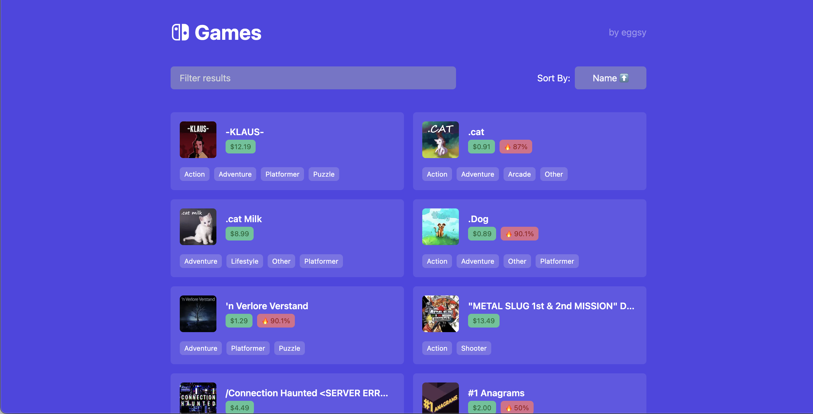

# Next.js Nintendo Switch e-Shop

  

Basic website built with Next.js and Tailwind CSS to display Nintendo Switch games. Not fully functional since there isn't a _usable_ API for this but has some cool features such as **filtering**, **ordering** and **infinite scrolling**.

Take it as a template and use it for your own projects, or just stare at the demo.
